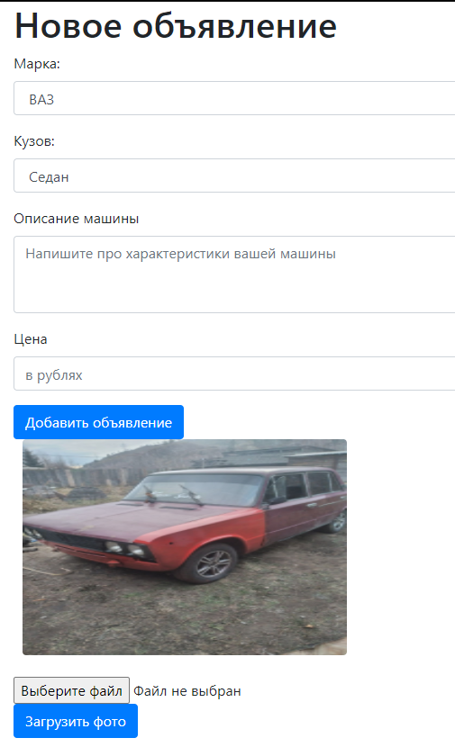

MazeGenerator
=============

Скриншоты сайта Cars
На главное странице имеется форма авторизации на сайт

при неправильном сочетании email и пароля или если email не существует
то появится сообщение об этом

Имеетя кнопка регистрации пользователя, при нажатии на которую вы попадете
на страницу регистрации

если попытатся зарегистрировать пользователя с email который уже есть в базе
появится сообщение

только зарегистрированный пользователь может добавлять объявление на доску
за это отвечает фильтр, если не зарегестрированный пользователь попытается добавить 
объявление то его перенаправит на страницу регистрации
страница нового объявления

Марка и кузов машины берется из выпадающего списка который получен из базы данных 
также можно загрузить фотографию автомашины
после нажатия кнопки добавить объявление оно будет сохранено в базу данных и добавлено
на доску на главное странице

пользователь может с помощью формы чекбокс может поставить метку что машина продана, после
этого система зарегистрируюет изменения в базе и появится надпись что машина продана, важно 
что пользователь может поставить метку о продаже только на своем объявлении на других она работать 
не будет, так же при клике по имени пользователя

будет выполнен выход из аккаунта
